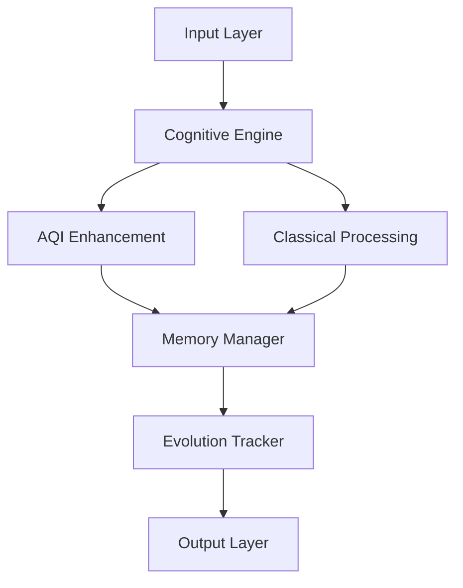

```markdown name=README.md
<div align="center">

# 🧠 SPED-A.G.I.
### Self-Progressive Evolutionary Device with AQI

*A modular, self-evolving intelligence core powered by Artificial Quantum Intelligence*


</div>

---

## 🚀 Project Overview

**SPED-A.G.I.** is an ambitious project developing a modular, self-evolving intelligence core enhanced by Artificial Quantum Intelligence (AQI). Our vision is to create a prototype AGI system that can **learn, reason, argue, and adapt across diverse domains**, leveraging both classical and quantum computing paradigms for enhanced cognitive capabilities.

### ⚖️ Proprietary License Notice
**Copyright © 2023-2025 Craig Huckerby (Craig444444444)**
All rights reserved.

- Commercial use prohibited during development
- Source code viewing/studying permitted
- Contributions require signed CLA
- All rights and improvements belong to Craig Huckerby
- Quantum computing implementations protected

---

## 🎯 Core Architecture

SPED-A.G.I. implements a layered, quantum-enhanced cognitive architecture:



### 🧩 Core Components

| Component | Description | Implementation |
|-----------|-------------|----------------|
| **Cognitive Engine** | Central processing unit managing both classical and quantum pathways | `core/cognition/engine.py` |
| **AQI System** | Quantum-enhanced processing with error mitigation | `core/aqi/` |
| **Memory Manager** | Long-term and working memory implementation | `core/memory/` |
| **Evolution Tracker** | Monitors and guides system evolution | `core/evolution/` |
| **Reasoning Engine** | Multi-modal reasoning implementation | `core/reasoning/` |

### ⚛️ AQI Integration

The Artificial Quantum Intelligence (AQI) layer provides:
- Quantum state preparation and measurement
- Adaptive error mitigation
- Quantum-classical hybrid processing
- Dynamic resource allocation
- Quantum-enhanced pattern recognition

---

## 🔬 Technical Implementation

### Core Technologies

```python
# Core dependencies
requirements = {
    "Classical": ["Python 3.11+", "TensorFlow", "PyTorch"],
    "Quantum": ["Qiskit", "PennyLane"],
    "Integration": ["NumPy", "AsyncIO"],
    "Runtime": ["Docker", "CUDA 12.0+"]
}

# Quantum Requirements
QUANTUM_SPECS = {
    "qubits": "20+ logical qubits",
    "coherence_time": "100μs+",
    "gate_fidelity": "99.9%+",
    "connectivity": "all-to-all"
}

# System Requirements
SYSTEM_REQUIREMENTS = {
    "hardware": {
        "cpu": "16+ cores, 3.5GHz+",
        "memory": "64GB+ DDR5",
        "storage": "1TB+ NVMe SSD",
        "network": "10Gbps+"
    },
    "software": {
        "os": ["Ubuntu 24.04 LTS", "RHEL 9.0+"],
        "python": "3.11+",
        "quantum_sdk": "2.0+"
    }
}
```

### Project Structure

```
sped-agi/
├── core/
│   ├── utils/
│   │   ├── timestamp_manager.py    # Timestamp management
│   │   ├── logging_manager.py      # Advanced logging
│   │   └── state_manager.py        # State management
│   ├── quantum/
│   │   ├── circuit_optimizer.py    # Quantum optimization
│   │   ├── error_correction.py     # Error correction
│   │   └── interface.py           # Quantum interface
│   ├── evolution/
│   │   ├── neural_search.py       # Neural architecture
│   │   ├── optimization.py        # Dynamic optimization
│   │   └── self_modify.py        # Self-modification
│   └── implementations/
│       └── base.py                # Base classes
```

---

## 🛠️ Getting Started

### Prerequisites

```bash
# Clone repository
git clone https://github.com/Craig444444444/SPED-AGI.git

# Install dependencies
pip install -r requirements.txt

# Initialize AQI components
python -m core.aqi.initialize
```

### Basic Usage

```python
from core.cognition import CognitiveEngine
from core.aqi import AQIResilienceEngine

# Initialize the system
engine = CognitiveEngine(
    mode="adaptive",
    quantum_enabled=True
)

# Process input with quantum enhancement
result = await engine.process_input(
    input_data,
    context={'domain': 'research'}
)
```

---

## 🤝 Contributing

All contributions must be under signed CLA:
1. Rights assign to Craig Huckerby
2. No implied licenses granted
3. Contributors credited but retain no rights

---

## 📈 Development Status

Current phase: **Active Development**
- ✅ Core architecture established
- ✅ AQI integration framework
- ✅ Timestamp management
- ✅ Logging system
- 🟡 State management
- 🟡 Quantum optimization
- ⭕ Advanced features

---

## 📞 Commercial Inquiries

For commercial licensing, enterprise implementation, or partnership inquiries:
- GitHub: [@Craig444444444](https://github.com/Craig444444444)

### Available Options
1. Development Sponsorship
2. Pre-Release Commercial License
3. Enterprise Partnership
4. Quantum Computing Integration

---

## 📄 Version Information
- Version: 1.0.0
- Created: 2025-05-31 17:09:59 UTC
- Last Updated: 2025-05-31 17:09:59 UTC
- Author: Craig Huckerby (Craig444444444)

---

*Copyright © 2023-2025 Craig Huckerby. All rights reserved.*
```

