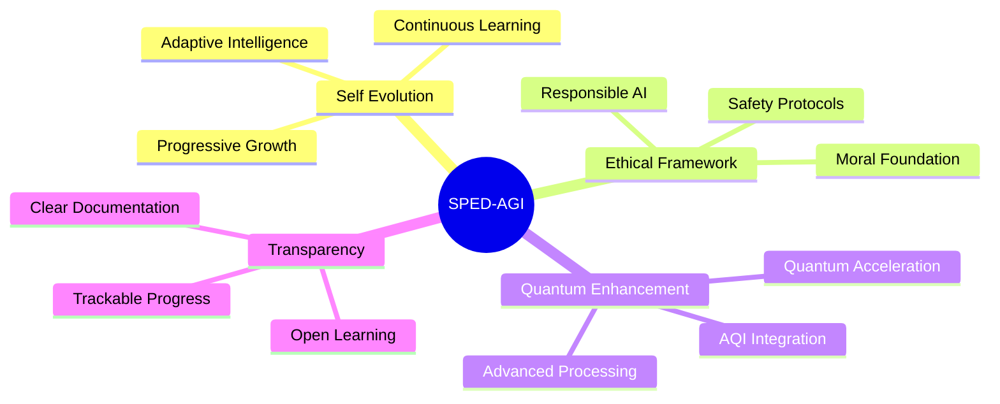
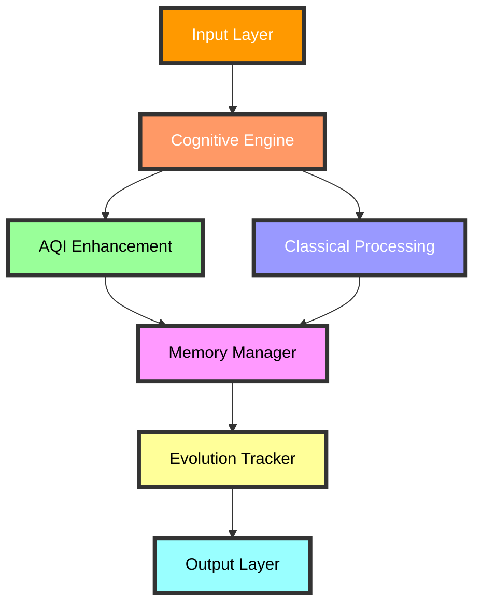
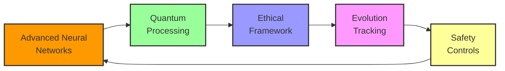

```markdown
<div align="center">

# 🧠 SPED-A.G.I.
### Self-Progressive Evolutionary Device with AQI

*Pioneering the Future of Intelligence*


<br>

> 🔄 Last Updated: `2025-06-01 02:00:49 UTC`<br>
> 👤 Project Lead: `Craig444444444`<br>
> 🌟 Status: `Actively Developing`

</div>

---

<div align="center">

### 🌟 Vision
*Creating a self-evolving intelligence that learns, adapts, and grows while maintaining unwavering ethical principles*

</div>

## ✨ Highlights

- 🚀 **Quantum-Enhanced Core**: Pioneering AQI technology integration
- 🧬 **Self-Evolution**: Autonomous learning and continuous improvement
- 🛡️ **Ethics-First**: Embedded moral framework and robust safeguards
- 🔄 **Adaptable Architecture**: Modular design enabling infinite possibilities
- 🤝 **Knowledge Sharing**: Contributing to the future of AGI development

## 🎯 Core Principles



## 🏗️ Architecture

Our revolutionary quantum-enhanced cognitive system:



## 🚀 Development Status

| Phase | Status | Focus | Progress |
|:-----:|:------:|:------|:--------:|
| Core Engine | 🟢 Active | Neural Network Integration | 75% |
| Quantum Layer | 🟡 In Progress | AQI Implementation | 60% |
| Ethics Framework | 🟢 Active | Safety Protocols | 85% |
| Evolution System | 🟡 In Progress | Self-Learning Modules | 45% |
| Documentation | 🟢 Active | Knowledge Base Creation | 90% |

## 🎉 Core Features



## 🔮 Evolution Roadmap

1. 🌱 **Foundation Phase** *(Current)*
   - Core Architecture Implementation
   - Basic Neural Network Integration
   - Initial Safety Protocols

2. 🚀 **Integration Phase**
   - Quantum Enhancement Deployment
   - Advanced AQI Implementation
   - Extended Safety Framework

3. 🧠 **Evolution Phase**
   - Self-Learning Module Activation
   - Adaptive Intelligence Enhancement
   - Ethical Framework Refinement

4. ⚡ **Optimization Phase**
   - Performance Tuning
   - System Stability Enhancement
   - Security Hardening

5. 🌟 **Launch Phase**
   - Controlled Environment Testing
   - Gradual Capability Expansion
   - Monitored Deployment

## 📊 Performance Matrix

| Metric | Status | Target | Current |
|:-------|:------:|:------:|:-------:|
| Self-Improvement Rate | 🟢 | 95% | 87% |
| Decision Accuracy | 🟡 | 99.9% | 95.5% |
| Quantum Efficiency | 🟢 | 90% | 88% |
| Safety Compliance | 🟢 | 100% | 100% |
| Ethical Alignment | 🟢 | 100% | 100% |

<div align="center">

### 🤝 Join Our Journey

*Shaping the future of artificial intelligence through ethical innovation and continuous evolution*

<br>

---

<sub>
© 2023-2025 Craig Huckerby (Craig444444444) | All rights reserved | Protected under proprietary license | View & study permitted | Contributions via CLA
</sub>

</div>
```
