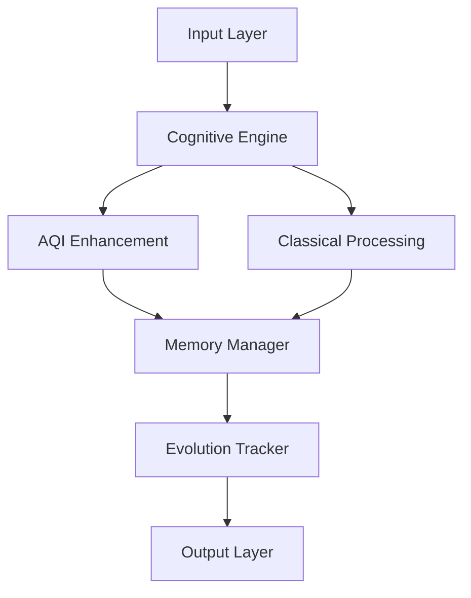

<div align="center">

# 🧠 SPED-A.G.I.
### Self-Progressive Evolutionary Device with AQI

*A modular, self-evolving intelligence core powered by Artificial Quantum Intelligence*


</div>

---

## 🚀 Project Overview

**SPED-A.G.I.** is an ambitious project developing a modular, self-evolving intelligence core enhanced by Artificial Quantum Intelligence (AQI). Our vision is to create a prototype AGI system that can **learn, reason, argue, and adapt across diverse domains**, leveraging both classical and quantum computing paradigms for enhanced cognitive capabilities.

This system grows from a general-purpose assistant into a self-refining thought engine, complete with:
- Quantum-enhanced cognitive processing
- Adaptive error mitigation
- Self-evolving neural architectures
- Dynamic memory management
- Multi-modal reasoning capabilities

---

## 🎯 Core Architecture

SPED-A.G.I. implements a layered, quantum-enhanced cognitive architecture:



### 🧩 Core Components

| Component | Description | Implementation |
|-----------|-------------|----------------|
| **Cognitive Engine** | Central processing unit managing both classical and quantum pathways | `core/cognition/engine.py` |
| **AQI System** | Quantum-enhanced processing with error mitigation | `core/aqi/` |
| **Memory Manager** | Long-term and working memory implementation | `core/memory/` |
| **Evolution Tracker** | Monitors and guides system evolution | `core/evolution/` |
| **Reasoning Engine** | Multi-modal reasoning implementation | `core/reasoning/` |

### ⚛️ AQI Integration

The Artificial Quantum Intelligence (AQI) layer provides:
- Quantum state preparation and measurement
- Adaptive error mitigation
- Quantum-classical hybrid processing
- Dynamic resource allocation
- Quantum-enhanced pattern recognition

---

## 🔬 Technical Implementation

### Core Technologies

```python
# Core dependencies
requirements = {
    "Classical": ["Python 3.10+", "TensorFlow", "PyTorch"],
    "Quantum": ["Qiskit", "PennyLane"],
    "Integration": ["NumPy", "AsyncIO"],
    "Runtime": ["Docker", "CUDA 12.0+"]
}
```

### Processing Modes

The system supports multiple processing modes:
- **Classical**: Traditional computing for basic tasks
- **Quantum**: AQI-enhanced processing for complex operations
- **Hybrid**: Dynamic allocation between classical and quantum resources
- **Adaptive**: Automatic mode selection based on task requirements

### Memory Architecture

```python
memory_system = {
    "short_term": "Working memory for active processing",
    "long_term": "Persistent storage with quantum encoding",
    "episodic": "Experience-based learning records",
    "semantic": "Knowledge representation networks"
}
```

---

## 🎯 Use Cases

### Primary Applications

1. **Research Assistant**
   - Multi-perspective analysis
   - Quantum-enhanced pattern recognition
   - Dynamic hypothesis generation

2. **Cognitive Computing Platform**
   - Hybrid classical-quantum processing
   - Adaptive resource allocation
   - Self-evolving capabilities

3. **Learning System**
   - Experience-based evolution
   - Multi-modal knowledge integration
   - Quantum-enhanced memory encoding

4. **Development Tool**
   - Code generation and analysis
   - Architecture optimization
   - Quantum algorithm design

---

## 🛠️ Getting Started

### Prerequisites

```bash
# Clone repository
git clone https://github.com/Craig444444444/SPED-AGI.git

# Install dependencies
pip install -r requirements.txt

# Initialize AQI components
python -m core.aqi.initialize
```

### Basic Usage

```python
from core.cognition import CognitiveEngine
from core.aqi import AQIResilienceEngine

# Initialize the system
engine = CognitiveEngine(
    mode="adaptive",
    quantum_enabled=True
)

# Process input with quantum enhancement
result = await engine.process_input(
    input_data,
    context={'domain': 'research'}
)
```

---

## 🤝 Contributing

We welcome contributions! Here's how you can help:

1. **Code Contributions**
   - Fork the repository
   - Create a feature branch
   - Submit a pull request

2. **Documentation**
   - Improve technical documentation
   - Add usage examples
   - Update architecture diagrams

3. **Testing**
   - Add unit tests
   - Perform integration testing
   - Report bugs and issues

---

## 📈 Project Status

Current development phase: **Prototype**
- ✅ Core architecture established
- ✅ AQI integration implemented
- ✅ Basic cognitive processing
- 🟡 Memory system in development
- 🟡 Evolution tracking in testing
- ⭕ Advanced features planned

---

## 📄 License

This project is licensed under the MIT License - see the [LICENSE](LICENSE) file for details.

---

## 🙏 Acknowledgments

Special thanks to:
- Quantum computing research community
- AGI development contributors
- Open-source AI projects

---

Created: 2025-05-31 16:03:36 UTC  
Author: Craig444444444
