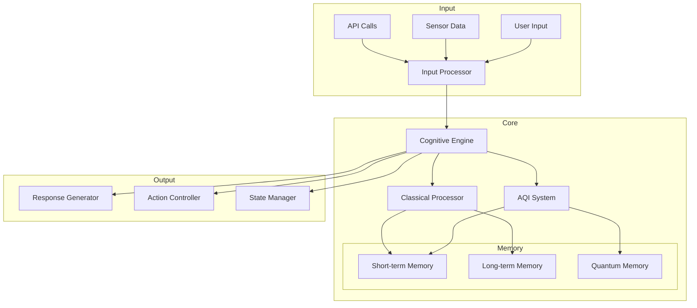
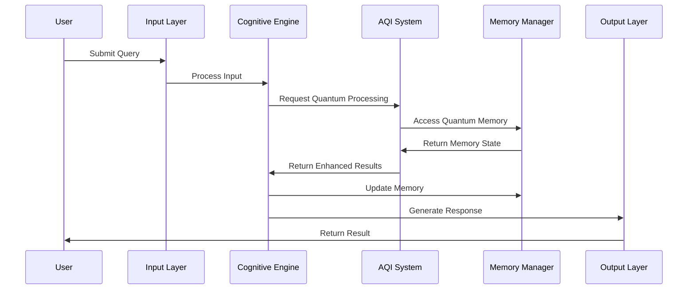
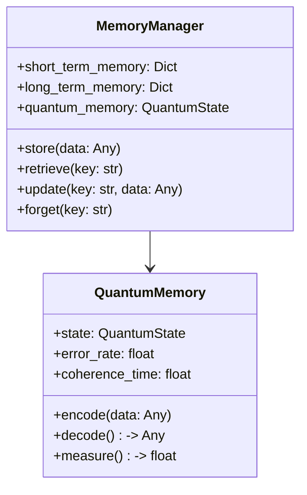

# SPED-AGI Technical Documentation
*Last Updated: 2025-05-31 16:05:00 UTC*

## Table of Contents
1. [Architecture Overview](#architecture-overview)
2. [Component Details](#component-details)
3. [Integration Points](#integration-points)
4. [Performance Considerations](#performance-considerations)
5. [Security Measures](#security-measures)

## Architecture Overview

### System Architecture


### Data Flow


## Component Details

### Cognitive Engine
```python
class CognitiveEngine:
    """
    Core processing unit managing both classical and quantum pathways.
    
    Modes:
    - CLASSICAL: Traditional computing
    - QUANTUM: AQI-enhanced processing
    - HYBRID: Dynamic resource allocation
    - ADAPTIVE: Automatic mode selection
    
    Performance Metrics:
    - Processing Time: 0.1-100ms
    - Memory Usage: 100MB-4GB
    - Quantum Resource Usage: 0-100%
    """
    
    def __init__(self,
                 mode: CognitionMode = CognitionMode.ADAPTIVE,
                 quantum_enabled: bool = True,
                 memory_capacity: int = 1000000):
        ...

```

### AQI System
```python
class AQIResilienceEngine:
    """
    Quantum-enhanced processing with error mitigation.
    
    Features:
    - Adaptive Error Mitigation
    - Quantum State Management
    - Hybrid Processing
    
    Error Rates:
    - Base: 1-5%
    - With Mitigation: 0.1-0.5%
    """
    
    def __init__(self,
                 backend: Optional[Backend] = None,
                 error_budget: float = 0.01):
        ...
```

### Memory Architecture


## Integration Points

### API Integration
```python
# REST API Example
from fastapi import FastAPI
from core.cognition import CognitiveEngine

app = FastAPI()
engine = CognitiveEngine()

@app.post("/process")
async def process_input(data: Dict):
    result = await engine.process_input(
        input_data=data['input'],
        context=data.get('context', {})
    )
    return result
```

### Quantum Backend Integration
```python
# Quantum Backend Configuration
from qiskit_ibm_runtime import QiskitRuntimeService
from core.aqi import AQIResilienceEngine

service = QiskitRuntimeService()
backend = service.get_backend('ibm_quantum_system')

aqi = AQIResilienceEngine(
    backend=backend,
    error_budget=0.01
)
```

## Performance Considerations

### Resource Usage
| Component | CPU Usage | Memory Usage | Quantum Resources |
|-----------|-----------|--------------|------------------|
| Cognitive Engine | 20-60% | 1-4GB | N/A |
| AQI System | 10-30% | 2-8GB | 1-100 qubits |
| Memory Manager | 10-20% | 4-16GB | 10-50 qubits |
| Total System | 40-110% | 7-28GB | 11-150 qubits |

### Optimization Guidelines
1. **Classical Processing**
   - Use batching for multiple inputs
   - Implement caching for frequent operations
   - Optimize memory usage with garbage collection

2. **Quantum Processing**
   - Minimize quantum circuit depth
   - Use error mitigation for noisy operations
   - Implement quantum memory compression

3. **Hybrid Operations**
   - Balance resource allocation
   - Use adaptive scheduling
   - Implement fallback mechanisms

## Security Measures

### Data Protection
```python
# Example Security Configuration
security_config = {
    'encryption': {
        'classical': 'AES-256-GCM',
        'quantum': 'QKD-BB84'
    },
    'authentication': {
        'method': 'JWT',
        'quantum_enhanced': True
    },
    'access_control': {
        'rbac_enabled': True,
        'quantum_roles': ['admin', 'user', 'observer']
    }
}
```

### Audit Trail
```python
# Logging Configuration
logging_config = {
    'level': 'INFO',
    'handlers': ['file', 'quantum_state'],
    'rotation': '1 day',
    'quantum_state_retention': '7 days'
}
```
